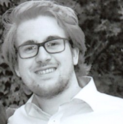

## About Me (Christopher Klamm, M.Sc., M.A.)
* 🗄 [Google scholar](https://scholar.google.de/citations?hl=de&authuser=1&user=oLSU8LEAAAAJ "Google scholar")
* 🔬 [UKP lab](https://www.informatik.tu-darmstadt.de/ukp/ukp_home/staff_ukp/detailseite_mitarbeiter_1_68224.en.jsp)
* 👥 [LinkedIn](https://www.linkedin.com/in/christopher-klamm-865786b3/)
* 🍿 [Twitter](https://twitter.com/chklamm)

Hi, I am Christopher a doctoral researcher in Natural Language Processing @ [UKP TU Darmstadt, <i>Prof. Dr. Iryna Gurevych</i>](https://www.informatik.tu-darmstadt.de/ukp/ukp_home/about_ukp/index.en.jsp). My work focuses on interdisciplinary research in Natural Language Processing for political and social good. I hold a master degree (2018, <i>with distinction</i>) in Computer Science (with a minor in philosophy) from the [Technical University Darmstadt](https://www.tu-darmstadt.de) (abroad semester at the University of Zurich and ETH Zurich (special student and research/ student assistant @ [Computational Social Science, <i>Prof. Dr. Helbing</i>](http://www.coss.ethz.ch))) and I hold a master degree in Governance and Public Policy from the [Technical University Darmstadt](https://www.tu-darmstadt.de) (2019).

## Research Interest (Political Science + NLP = 🎉)
* NLP for political and social/ public good
* NLP enriched methods for political science (e.g., framing or argumentation analysis)
* NLP-based (political) bias analysis

## Additional qualifications and skills (selected):
* Higher Education Certificate (2018-today), Foundations of Academic Teaching I & II and advanced academic qualifications (Gender Equality and Diversity (2021), ...), [HDA @ TU Darmstadt](https://www.hda.tu-darmstadt.de/angebote_fuer_lehrende_1/zertifikat_hochschullehre_1/zertifikat_1.de.jsp)
* University Certificate “Writing Tutoring and Writing Skills Training” (2015-2017, >300h) and advanced writing qualifications ("Academic Language" (2019, 3 days), "Creative Writing" (2018, 3 days), "Writing Center Management" (2017, 3 days)), [SchreibCenter @ TU Darmstadt](https://www.owl.tu-darmstadt.de/schreibcenter_1/index.de.jsp)
* University Certificate "Team and presentation Training" (2014-2018, >150h), [Hochschuldidaktische Arbeitsstelle @ TU Darmstadt](https://www.hda.tu-darmstadt.de/hda/index.de.jsp)
* University Certificates "Stress Management" (2020, >70h), "Autogenous Training" (2018) and "Relaxing Coach" (2017), [Darmstädter Akademie für Gesundheit und Sport @ TU Darmstadt](https://www.sport.tu-darmstadt.de/dienstleistungen/fortbildungen_ifs.de.jsp)
